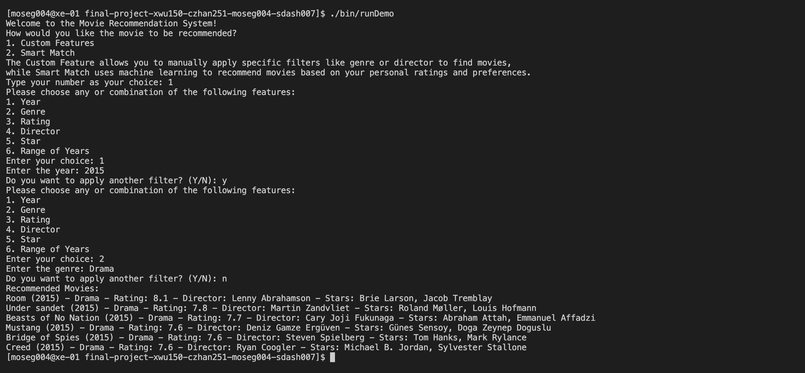
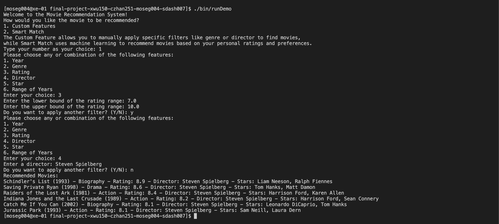
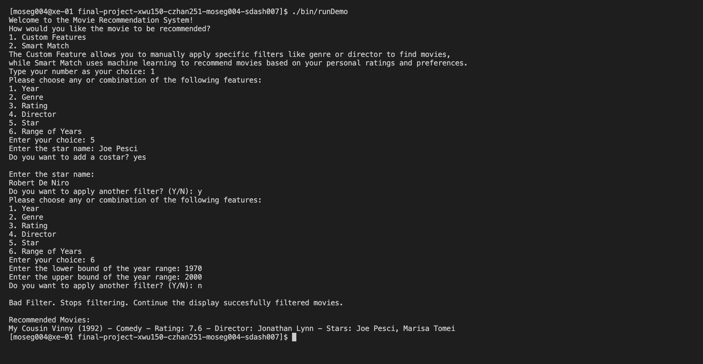
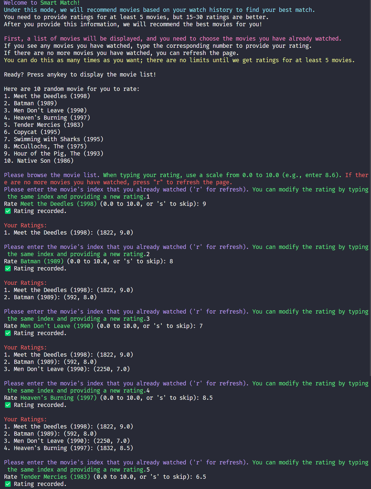
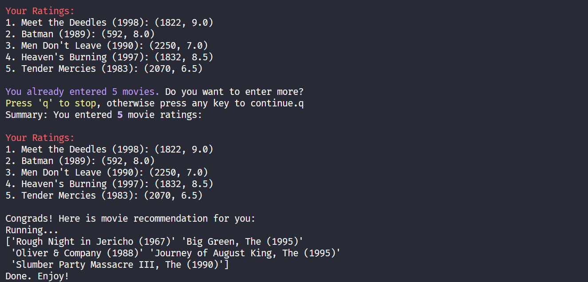

# Movie Recommendation
 
**Authors**

[](https://github.com/XiyuanWu)
[](https://github.com/fish-mouse)
[](https://github.com/Mickael723)
[](https://github.com/SwarajDash26)


## Project Overview:

We propose to develop a movie recommendation system to enhance user experience through personalized movie recommendations. Our system utilizes filters to enable users to receive movie recommendations tailored to their preferences. This system uses C++ and Python to provide an interactive user interface through the terminal. This project appealed to our team because it offered a practical application of machine learning and data parsing techniques, skills for our future technology.

### Customization Features:

Our system features six dynamic filters: year, genre, rating, director, and major stars (star 1 and star 2). Users can apply one to all six filters, customizing suggestions for precise specifications. For example, users can discover movies of a specific genre directed by selected filmmakers, with ratings equal to or above a particular threshold. This personalized approach ensures that recommendations align with user preferences, increasing satisfaction and engagement.

### Intelligent Matching System:

Our system's "Smart Match" component utilizes Python-based machine learning and collaborative filtering techniques. Users first rate at least five movies they have previously seen. The system then analyzes this input and recommends 15-30 movies, fine-tuning them to match the user's viewing history and preferences. Smart Match directly integrates user feedback into the recommendation process and provides highly relevant and enjoyable movie suggestions.


## User Interface Specification

### Navigation Diagram

 

### Screen Layouts


## Class Diagram


*Old diagram see [here](./Element/UML%20Class%20Diagram%20(old).svg).*

### What's New?
  - **MovieFilter is now an abstract class with subclasses:**
    
       Each subclass of MovieFilter now implements a pure virtual filter() function that suits the needs of their own responsibility (S, I). The subclasses are allowed to implement     
       filters in their own way as well as create their own functions that don’t have to be implemented anywhere else (O, L). This allows us to add other filters without touching the 
       abstract base class.
    
  - **The Movie Dataset has been moved to its own MovieListClass:**
    
       We have the MovieList class to manage the vector of movies loaded from the database and recommended by the system(S). This object frees responsibility from the MovieFilter  
       class  
       and allows all other classes to access the MovieList.
  - **User Input class has been replaced with Display and Loadfile classes.**
 
       The new display class is responsible for handling input and output (S, I). Loadfile takes the responsibility of loading a csv file away from MovieFilter which allows both 
       classes to carry only one responsibility(S, D). These changes allow us to implement these aspects of the programming separately from the filtering which means development of 
       new features will happen at a faster pace.

 

-  **C++ Section**:
   - **Display**: This class handles the selection menu to the user as well as outputs the recomended movies to the user after the program is finished.
   - **LoadFile**: This class loads a csv file that contains a list of movies and their attributes from the program directory. The MovieList object is then initialized using this list                     of movies 
   - **MovieList**: This class contains the entire database of movies which will then be filtered down by the end of the program.
   - **MovieFilter**: This interface implements a pure virtual function called filter() which filters the movieList based on the choices the user made in the menu.
      - RatingFilter: Subclass of MovieFilter that filters the movieList based on a specified rating
      - GenreFilter: Subclass of MovieFilter that filters the movieList based on a specified genre
      - YearFilter: Subclass of MovieFilter that filters the movieList based on a specified year
      - StarFilter: Subclass of MovieFilter that filters the movieList based on a specified actor
      - DirectorFilter: Subclass of MovieFilter that filters the movieList based on a specified director
   - **Movie**: Represents individual movie data including attributes like title, year, genre, rating, director, and stars.
   
-  **Python Section (SmartMatch)**:
   - Handles a different aspect of movie recommendations using user ratings and machine learning algorithms.
   - Functions include loading movies, displaying instructions, selecting random movies for rating, collecting user ratings, generating personalized recommendations based on these ratings, and displaying the results.
 
 ## Screenshots

 ### Customization Features





### Intelligent Matching System



 ## Installation/Usage

1. Clone the project repository from GitHub.
2. Run following command in order: 
```
$ cmake .
$ make
```
Then brower different option below:
```
# Run Movie Recommendation Application: 
$ ./bin/runDemo

- Unit Tests: 
$ ./bin/runClassTests

# Memory check: 
$ valgrind ./bin/runClassTests
```

 ## Testing
 


#### Chengrui Zhang
My approach was test driven design, by writing my tests before coding the functions. I wrote the following: all tests in MovieConstructor, validStringInput, validYesOrNo, setDirectorNameTest, searchVectorDirectorTest, gatherResultDirectorTest,  setterGetterStarNameTest, searchVectorTest, and gatherResultTest. These tests ensure the setters and getters function, no invalid inputs are sent in, and the filter can work. Overall, I tested my program by ensuring that my code considers various edge cases such as yes typed in different formats or accidental non-letter characters. 

#### Mickael Osegueda
I used test driven design to write tests and functions for my features. I worked on the following:
LoadFileTests, MovieListAllocation Tests, YearFilterSingleInputTests, YearFilterRangeTests.
I tested my code by first creating tests in the test file and then working on the functions until they pass each test. LoadFileTests are for the LoadFile class which requires testing the reading of csv files and proper allocation of Movie objects. MovieList Allocation tests make sure that the filters properly delete allocated pointers so no memory leaks occur. YearFilterSingleInput and Range tests are for testing the inputs, filtering process, and proper maintenance of the MovieList for the MovieFilter functions I worked on. 


#### Swaraj Dash
For my testing approach, I first implemented the core functions in the initial development phase. I then designed comprehensive test cases to validate these functions, covering various scenarios and edge cases. After running the tests, I identified and fixed issues in the code where some tests failed. This iterative process of testing and debugging continued until all tests were successful. Specifically, I wrote tests for the MovieFilterGenre and MovieFilterRating classes to verify the filtering mechanisms. Additionally, I tested the MovieList destructor to ensure proper memory deallocation and prevent memory leaks. I also tested the displayRecResult functions in Display.cpp to confirm they produced the desired output. This rigorous approach ensured that all functions met the requirements and performed reliably.

